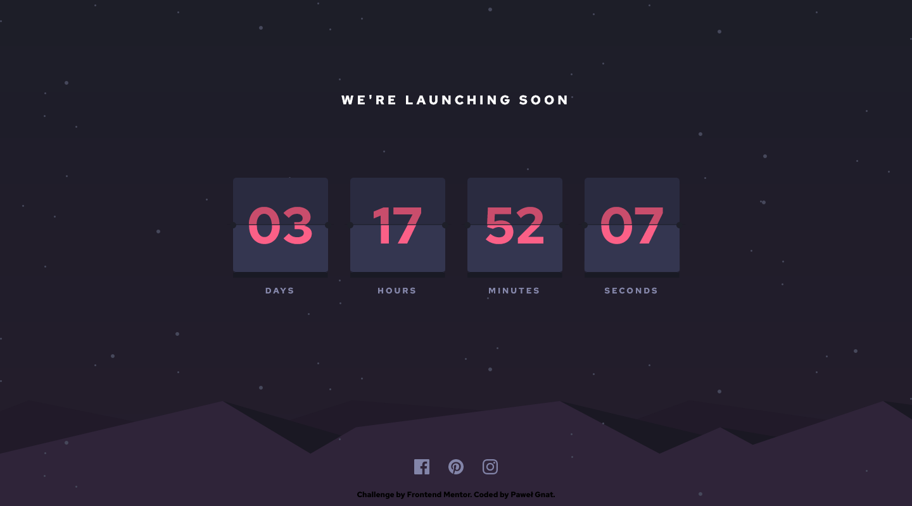

# Frontend Mentor - Launch countdown timer solution

This is a solution to the [Launch countdown timer challenge on Frontend Mentor](https://www.frontendmentor.io/challenges/launch-countdown-timer-N0XkGfyz-). Frontend Mentor challenges help you improve your coding skills by building realistic projects.

## Table of contents

- [Overview](#overview)
  - [Screenshot](#screenshot)
  - [Links](#links)
- [My process](#my-process)
  - [Built with](#built-with)
  - [What I learned](#what-i-learned)
- [Author](#author)

## Overview

### Screenshot

### Links

- Live Site URL: [Frontend Mentor Launch countdown timer](https://pawel-gnat.github.io/Frontend-Mentor-Launch-countdown-timer/)

## My process

I coded basic structure of my flipping cards and then I started to search how to implement java script timer logic. I found it quite hard and I had to reuse some of [crsimpson5](https://github.com/crsimpson5/launch-countdown-timer/blob/main/script.js) code.

### Built with

- Semantic HTML5 markup
- CSS custom properties
- Flexbox
- Mobile-first workflow
- JavaScript

### What I learned

Code time: 8,5 hours.

I learned how to change my transform origin and how perspective works. I set my timer for the first time with setHours/getHours function.

In addition I learned about .padStart from [crsimpson5](https://www.frontendmentor.io/solutions/responsive-countdown-timer-made-using-vanilla-js-sass-3wnMC395Zn) code. His JS logic has helped me a lot.

## Author

- Frontend Mentor - [@Pawel-Gnat](https://www.frontendmentor.io/profile/Pawel-Gnat)
